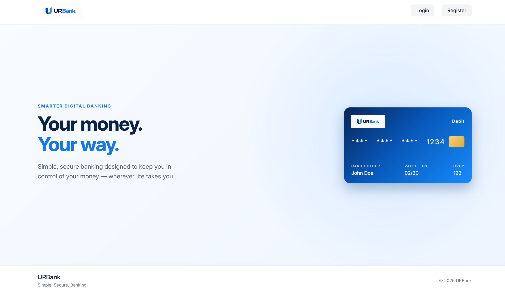

# Digital Banking System (URBank)

URBank is a simulated digital banking application with a React frontend and a Spring Boot backend. It lets customers manage accounts, view balances and transaction history, transfer money, and use a simulated ATM. The project demonstrates session-based authentication, account ownership checks, and atomic financial operations backed by a ledger.

Amounts are denominated in SEK. Debit card details and ATM cash operations are simulated; the application does not connect to payment networks or external banks.

## Live Demo

URBank is deployed and available to try online.

[Try the Digital Banking System](http://2.29.57.220/)

<!-- Replace YOUR-LIVE-URL with the public production URL before publishing. -->

> Note: The application works on both desktop and mobile, but it is currently optimized primarily for desktop. Mobile responsiveness is still being improved.



## Functionality

- Register, sign in, sign out, and view customer profile details.
- Receive a Main Account and one debit card at registration. Additional checking or savings accounts do not receive cards.
- View account balances, an account summary, recent activity, and individual account history.
- Transfer money between owned accounts or to another URBank customer's account using a ten-digit recipient account number.
- View debit card details and reveal the card PIN after verifying the application password.
- Verify the card PIN in the simulated ATM, then deposit or withdraw money from an active owned account.

Transfers and withdrawals require sufficient funds. Financial operations commit the transaction and its ledger entries together; rejected operations do not change balances.

## Architecture

The frontend is a React single-page application using React Router, JavaScript, and CSS. Vite provides the development server and production build. In the frontend container, nginx serves the built files and forwards API requests to Spring Boot.

```text
Browser
  -> nginx :80
       -> React static files and client-side routes
       -> /api/* -> backend :8080 -> MySQL
```

Frontend requests use relative `/api/...` URLs and include session cookies. During local development, Vite proxies the same paths to `http://localhost:8080`. In the container setup, nginx proxies them to `http://backend:8080`, preserving the API path. The backend must therefore be reachable as `backend` on the frontend container's network.

The backend uses Java 21, Spring Boot 4.1.1, Spring MVC, Spring Security, Bean Validation, and Spring Data JPA/Hibernate. Requests pass through controllers, services, and repositories, with DTOs defining API inputs and outputs. Authentication uses an HTTP session rather than JWTs. Passwords are hashed with BCrypt, and state-changing requests require a CSRF token.

### Database and financial model

MySQL 8.4 stores six application tables: `customer`, `password_credential`, `account`, `card`, `bank_transaction`, and `ledger_entry`.

A customer owns multiple accounts. A card belongs directly to its account, and customer ownership is resolved through that account. The database allows at most one card per account; registration is the application flow that issues the customer's single card.

Balances are calculated from signed ledger entries rather than stored on accounts. A transfer creates an outgoing and an incoming entry; a deposit or withdrawal creates one entry. Monetary values use `BigDecimal` and `DECIMAL(19,2)`. Financial services use database transactions and pessimistic account locks to keep balance checks and writes consistent.

Flyway's [initial migration](backend/src/main/resources/db/migration/V1__initial_schema.sql) creates the schema in an empty database. Both the `local` and `prod` profiles use Hibernate schema validation. Flyway is disabled in `local` and enabled by default in `prod`. V1 is not an upgrade script for an existing schema.

Card PINs are encrypted with AES-256-GCM. The startup `CardPinMigration` converts legacy plaintext PINs and validates existing encrypted PINs using the configured key.

## Project structure

```text
backend/
  src/main/java/           Controllers, services, repositories, entities, security
  src/main/resources/      Application profiles and Flyway migrations
  src/test/                Unit, service, and integration tests
  Dockerfile               Multi-stage Java build and runtime image
frontend/
  src/pages/               Banking pages and forms
  src/components/          Shared UI and transaction history
  src/style/               Component and page styles
  vite.config.js           Local API proxy
  nginx.conf               Static serving and production API proxy
  dockerfile               React build and nginx runtime image
docs/                      API, requirements, domain, and database documentation
images/                    Application screenshot and domain/database diagrams
docker-compose.yaml        Frontend, backend, and MySQL deployment services
.github/workflows/         Backend tests, image publishing, and VPS deployment
```

## Local development

Install JDK 21, Node.js 22 (the version used by the frontend image), npm, and MySQL 8.4. The backend includes a Maven wrapper. Create a development database and supply the following environment variables before starting the backend:

| Variable | Purpose |
| --- | --- |
| `DEV_DB_URL` | JDBC URL of the development database |
| `DEV_DB_USER` | Development database username |
| `DEV_DB_PASSWORD` | Development database password |
| `CORS_ALLOWED_ORIGIN` | Frontend origin; normally `http://localhost:5173` locally |
| `CARD_PIN_ENCRYPTION_KEY` | Base64-encoded 32-byte key for card PIN encryption |

Keep the encryption key stable for a database containing cards. Existing encrypted PINs cannot be read with a different key, and startup validation will fail. The profile configuration also supports an optional `secrets.yaml` in the backend working directory; keep private values out of version control.

From the repository root, start the backend:

```sh
cd backend
./mvnw spring-boot:run "-Dspring-boot.run.profiles=local"
```

The local profile expects a compatible schema. For the first start against a **new, empty development database**, enable Flyway for that run:

```sh
./mvnw spring-boot:run "-Dspring-boot.run.profiles=local" "-Dspring-boot.run.arguments=--spring.flyway.enabled=true"
```

In a separate terminal, from the repository root:

```sh
cd frontend
npm ci
npm run dev
```

Open the URL printed by Vite, normally `http://localhost:5173`. The backend listens on port 8080 by default. If Vite selects a different port, update `CORS_ALLOWED_ORIGIN` to match the frontend origin.

These commands use shell syntax supported by Git Bash and Unix shells. In Windows PowerShell, use `./mvnw.cmd` and `npm.cmd` instead of `./mvnw` and `npm`.

## Containers and production configuration

Build the two application images from the repository root:

```sh
docker build -t digital-banking-backend ./backend
docker build -f frontend/dockerfile -t digital-banking-frontend ./frontend
```

The backend image builds the application with Maven and runs it on a Java 21 runtime. Its image build skips tests; the workflow runs them separately. The frontend image builds with Node.js 22 and serves the output with nginx on port 80, including fallback to `index.html` for client-side routes.

For the backend container, activate the `prod` profile with `SPRING_PROFILES_ACTIVE` and supply `PROD_DB_URL`, `PROD_DB_USER`, and `PROD_DB_PASSWORD`, plus `CARD_PIN_ENCRYPTION_KEY` and `CORS_ALLOWED_ORIGIN`. The database must already exist and be reachable from the backend. Flyway creates application tables on first startup against an empty database, followed by Hibernate validation.

The [Docker Compose configuration](docker-compose.yaml) runs the published frontend and backend images alongside MySQL 8.4. The frontend exposes port 80; the backend and database communicate over the Compose network. The backend starts after MySQL passes its health check, and database files persist in the `mysql_data` named volume.

Supply the following variables through the deployment environment or a private `.env` file alongside the Compose configuration:

| Variable | Purpose |
| --- | --- |
| `DB_PASSWORD` | MySQL application user password, also passed to the backend |
| `DB_ROOT_PASSWORD` | MySQL root password |
| `CARD_PIN_ENCRYPTION_KEY` | Stable Base64-encoded 32-byte card PIN encryption key |
| `CORS_ALLOWED_ORIGIN` | Origin from which users access the frontend |

From the directory containing the Compose configuration:

```sh
docker compose pull
docker compose up -d
```

Compose selects the backend's `prod` profile and supplies its database connection settings. Keep deployment secrets outside version control.

## Testing and CI/CD

Backend tests cover authentication, registration, account access, cards and PINs, ledger balances, transaction history, transfers, ATM operations, and rollback behavior. To run the complete suite, configure `TEST_DB_URL`, `TEST_DB_USER`, `TEST_DB_PASSWORD`, and `CORS_ALLOWED_ORIGIN`, then run:

```sh
cd backend
./mvnw test
```

Use a dedicated disposable MySQL database: the test profile uses Hibernate `create-drop`. It supplies its own fixture PIN encryption key.

Frontend checks are:

```sh
cd frontend
npm run lint
npm run build
```

There is currently no frontend test script or automated frontend test suite configured.

The [GitHub Actions workflow](.github/workflows/backend-ci-cd.yml) runs backend tests with a MySQL 8.4 service for pull requests and pushes to `main`. After successful tests on a push to `main`, it builds and publishes backend and frontend images to Docker Hub with `latest` tags. Authentication uses the repository variable `DOCKERHUB_USERNAME` and secret `DOCKERHUB_TOKEN`.

After the image build job succeeds, the deployment job connects to the VPS using `appleboy/ssh-action`. It pulls the images and starts the services with `docker compose pull` and `docker compose up -d`. SSH access uses the GitHub Actions secrets `HOST`, `USERNAME`, `KEY`, and `PORT`.

The VPS must already have Docker with the Compose plugin, the project directory and Compose configuration expected by the workflow, and the required deployment variables. The job updates running containers; it does not provision the server or synchronize repository files. The image names in Compose must match those published by the build job.

Detailed contracts and domain rules are documented in [API](docs/api.md), [domain model](docs/domain-model.md), [database design](docs/database-design.md), and [requirements](docs/requirements.md). The current application configuration takes precedence where those documents differ.
