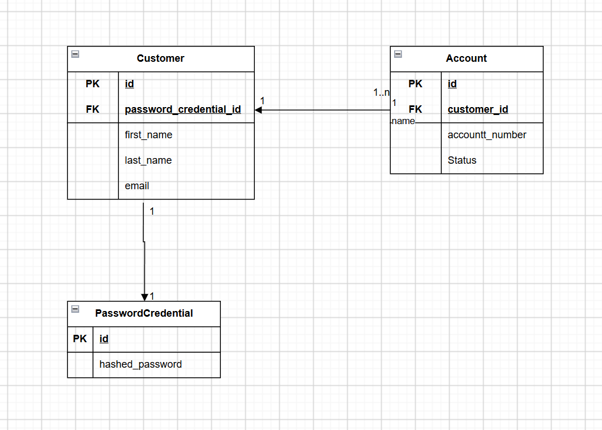

# Database Design

The database design represents the current persistence model of the Digital Banking System.

It contains the `Customer`, `Account`, and `PasswordCredential` tables and shows their primary keys, foreign keys, and relationships.

The design will evolve as new requirements are introduced.

## Database Diagram

