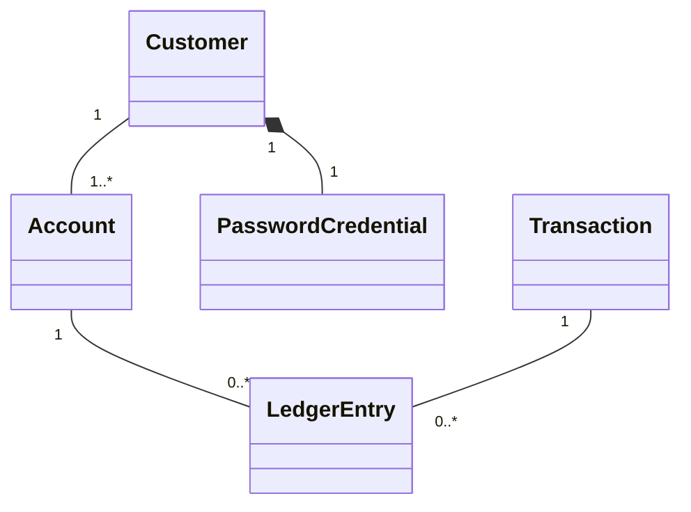

# Domain Model

The domain model represents the current core concepts of the Digital Banking System and their relationships.

## Design Decisions

### Password Credentials

`PasswordCredential` is modeled separately from `Customer` to separate authentication data from customer information.

A `PasswordCredential` belongs exclusively to a `Customer` and follows the customer's lifecycle.

### Account Types

An `Account` has an `AccountType` that describes the purpose of the account.

The system currently supports two account types:

- `Checking` — intended for everyday banking activities.
- `Savings` — intended for saving money.

An account also has a user-friendly name, allowing a customer to distinguish between multiple accounts.

### Account Status

An `Account` has an `AccountStatus` that represents its current state.

The system currently supports three account statuses:

- `Active` — the account is active and can be used normally.
- `Frozen` — the account is temporarily restricted.
- `Closed` — the account is no longer active.

### Transactions

A `Transaction` represents a financial event in the banking system.

The system currently models three transaction types:

- `Deposit`
- `Withdrawal`
- `Transfer`

A transaction also has a status representing its current state:

- `Pending`
- `Completed`
- `Failed`

A transaction may be associated with multiple `LedgerEntry` records.

A transaction stores its type, positive `BigDecimal` amount, `Instant` creation
time, and status. The persistence model supports all three statuses; V1 financial
operations will persist only `COMPLETED` transactions. Operation services are not
implemented in the current foundational step.

### Ledger Entries

A `LedgerEntry` represents the financial effect of a transaction on a specific account.

- An `Account` can have zero or more ledger entries.
- A `Transaction` can have zero or more ledger entries.
- Each `LedgerEntry` belongs to exactly one `Account`.
- Each `LedgerEntry` belongs to exactly one `Transaction`.

Ledger amounts are signed: positive amounts enter an account and negative amounts
leave it. Ledger entries require a completed transaction and a non-zero amount.
Amounts are implicitly SEK, stored with two decimal places. Trailing zeros are
normalized without rounding; non-zero fractional digits beyond two places are rejected.

An account can have multiple ledger entries, and a transaction can produce multiple ledger entries.
For example, a transfer between two accounts can produce one ledger entry for the source account and another ledger entry for the destination account.

### Account Balance

Balance is not stored directly on `Account`.

An account's balance is derived from its `LedgerEntry` records.

Balance is the sum of signed ledger amounts. An account with no entries has a
balance of zero. `AccountBalanceService` provides internal single-account and
grouped calculations; callers are responsible for resolving and authorizing accounts.
Balance is not yet exposed through the account API in this foundational step.

This allows the ledger to act as the record of financial changes to the account.
