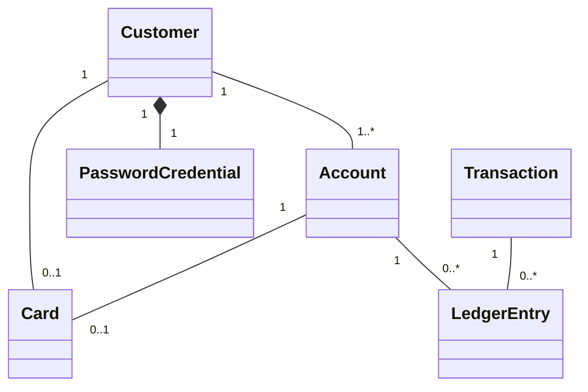

# Domain Model

The domain model represents the current core concepts of the Digital Banking System and their relationships.

## Design Decisions

### Debit Card

New registration creates one debit card linked directly to the newly created
Main Account and its customer. Existing customers can have no card. Opening
additional accounts does not issue cards. A card's account must belong to its
customer. Credit cards and card payments are not implemented.

Card details are simulated: a unique 16-digit string number, a non-unique
3-digit string CVC2, and an expiry date three calendar years after issuance
using Europe/Stockholm. Leading zeros are preserved; leap-day expiry follows
Java calendar-year arithmetic (February 28 in a non-leap year).

The authenticated owner's API exposes the full card number, its last four digits, the customer's current full
name, expiry, CVC2, and the constant type `DEBIT`.

### Password Credentials

`PasswordCredential` is modeled separately from `Customer` to separate authentication data from customer information.

A `PasswordCredential` belongs exclusively to a `Customer` and follows the customer's lifecycle.

### Account Types

An `Account` has an `AccountType` that describes the purpose of the account.

The system currently supports two account types:

- `Checking` — intended for everyday banking activities.
- `Savings` — intended for saving money.

An account also has a user-friendly name, allowing a customer to distinguish between multiple accounts.

### Account Status

An `Account` has an `AccountStatus` that represents its current state.

The system currently supports three account statuses:

- `Active` — the account is active and can be used normally.
- `Frozen` — the account is temporarily restricted.
- `Closed` — the account is no longer active.

### Transactions

A `Transaction` represents a financial event in the banking system.

The system currently models three transaction types:

- `Deposit`
- `Withdrawal`
- `Transfer`

A transaction also has a status representing its current state:

- `Pending`
- `Completed`
- `Failed`

A transaction may be associated with multiple `LedgerEntry` records.

A transaction stores its type, positive `BigDecimal` amount, `Instant` creation
time, and status. The persistence model supports all three statuses; V1 financial
operations persist only `COMPLETED` transactions. Transfers and simulated ATM deposits and withdrawals are implemented.

### Ledger Entries

A `LedgerEntry` represents the financial effect of a transaction on a specific account.

- An `Account` can have zero or more ledger entries.
- A `Transaction` can have zero or more ledger entries.
- Each `LedgerEntry` belongs to exactly one `Account`.
- Each `LedgerEntry` belongs to exactly one `Transaction`.

Ledger amounts are signed: positive amounts enter an account and negative amounts
leave it. Ledger entries require a completed transaction and a non-zero amount.
Amounts are implicitly SEK, stored with two decimal places. Trailing zeros are
normalized without rounding; non-zero fractional digits beyond two places are rejected.

An account can have multiple ledger entries, and a transaction can produce multiple ledger entries.
For example, a transfer between two accounts can produce one ledger entry for the source account and another ledger entry for the destination account.

Transaction history reads these account-specific movements without changing balances.
History uses the signed ledger amount and the linked transaction's time/type/status.
Recent customer activity retains both sides of transfers between owned accounts,
with account context, and excludes movements on other customers' accounts.

### Account Balance

Balance is not stored directly on `Account`.

An account's balance is derived from its `LedgerEntry` records.

Balance is the sum of signed ledger amounts. An account with no entries has a
balance of zero. `AccountBalanceService` provides internal single-account and
grouped calculations; callers are responsible for resolving and authorizing accounts.
The account API exposes ledger-derived balances to the authenticated owner.

This allows the ledger to act as the record of financial changes to the account.

### Customer Transfers

Both own-account transfers and transfers to another URBank customer use one
`TRANSFER` transaction with status `COMPLETED` and exactly two entries: a negative
source debit and equal positive destination credit. The source belongs to the
session customer; both accounts must be ACTIVE and different. No overdraft is allowed.
The entire movement commits or rolls back together; rejected requests do not persist
PENDING or FAILED attempts. Monetary normalization and SEK semantics remain unchanged.
### Simulated ATM and Card PIN

The existing card has a randomly generated four-digit PIN encrypted with AES-256-GCM.
Each encryption uses a new random nonce and authenticated ciphertext. Recoverable
encryption supports the owner's requested Show PIN feature; PINs are not stored as
plaintext or returned by the ordinary card endpoint. Show PIN checks the owner's
application password with the existing BCrypt PasswordEncoder before decrypting.
No customer ID is accepted. Password/PIN DTOs redact their string representations.

ATM PIN matching happens on the backend with constant-time comparison after decryption.
Successful verification records the current card ID in the existing HTTP session.
Every cash operation checks that verification belongs to the current principal's card.
Incorrect PIN or Eject Card clears verification; session expiry ends it. No separate
ATM-session database or reset/change workflow is added.

Deposit and withdrawal each create one completed transaction with a positive amount
and one ledger entry on the selected ACTIVE owned account: positive for deposit,
negative for withdrawal. The linked Main Account does not restrict which owned ACTIVE
account may be selected. Card has no balance. Withdrawal checks ledger-derived funds
after acquiring the account lock, allows exact-balance withdrawal, and forbids overdraft.
