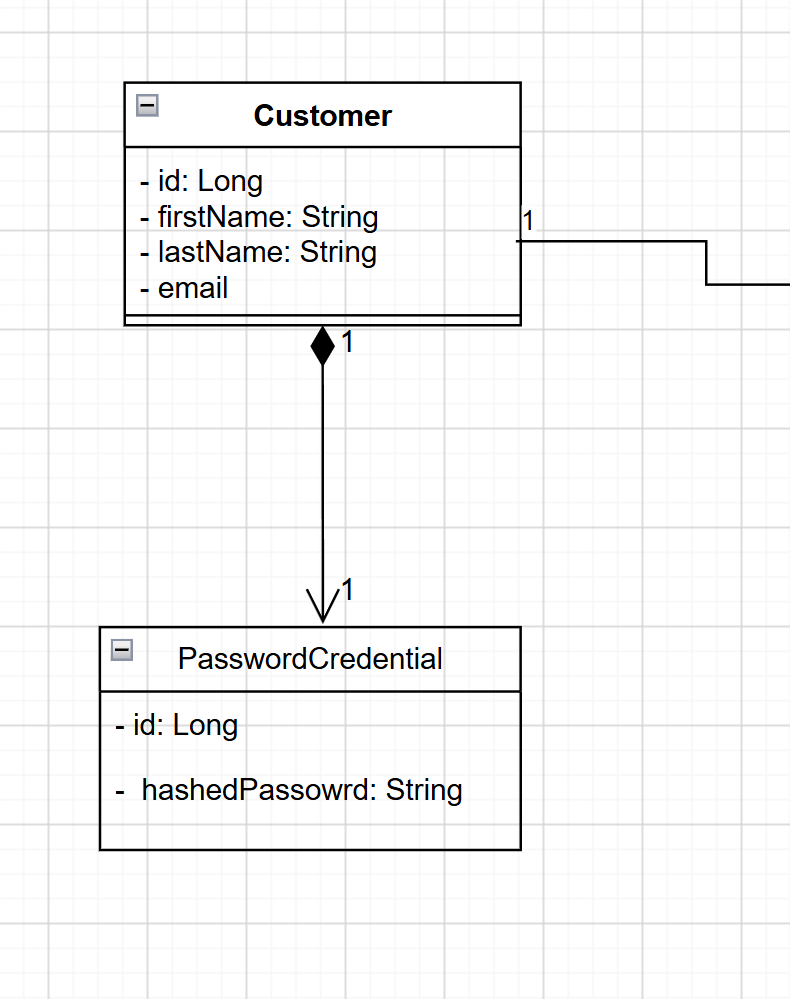

# Domain Model

The domain model represents the current core concepts of the Digital Banking System and their relationships.

## Design Decisions

### Password Credentials

`PasswordCredential` is modeled separately from `Customer` to separate authentication data from customer information.

A `PasswordCredential` belongs exclusively to a `Customer` and follows the customer's lifecycle.

### Account Balance

Balance is not stored directly on `Account`. It will be calculated from the account's transaction history when transaction functionality is introduced.